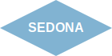

# Урок 3: Создание шапки и навигации

## Цели урока
- Создать шапку сайта (header)
- Добавить навигационное меню
- Стилизовать логотип и ссылки
- Изучить Flexbox для выравнивания элементов

## 3.1 HTML разметка шапки

Шапка сайта обычно содержит:
- Логотип
- Основное меню навигации
- Дополнительные элементы (поиск, корзина, профиль)

```html
<header class="page-header">
    <nav class="navigation">
        <!-- Логотип -->
        <a class="navigation-logo" href="index.html">
            
        </a>
        
        <!-- Основное меню -->
        <ul class="navigation-list">
            <li class="navigation-item">
                <a class="navigation-link" href="index.html">Главная</a>
            </li>
            <li class="navigation-item">
                <a class="navigation-link" href="#about">О Седоне</a>
            </li>
            <li class="navigation-item">
                <a class="navigation-link" href="#hotels">Гостиницы</a>
            </li>
        </ul>
        
        <!-- Пользовательское меню -->
        <ul class="navigation-user">
            <li class="navigation-item">
                <a class="navigation-link" href="#search">
                    <span class="visually-hidden">Поиск</span>
                </a>
            </li>
            <li class="navigation-item">
                <a class="navigation-link" href="#favorites">
                    <span class="visually-hidden">Избранное</span>
                </a>
            </li>
            <li class="navigation-item">
                <a class="navigation-link button button-primary" href="#booking">
                    Хочу сюда!
                </a>
            </li>
        </ul>
    </nav>
</header>
```

### Разбор кода:

1. **`<nav>`** - семантический тег для навигации
2. **`<ul>` и `<li>`** - списки для пунктов меню
3. **Два отдельных списка** - основное меню и пользовательское меню
4. **Скрытый текст** - для иконок (доступность)

## 3.2 CSS для шапки - Flexbox

Flexbox - современная техника выравнивания элементов.

```css
.page-header {
    position: relative;
    max-width: 1200px;
    margin: 0 auto;
    background-color: #ffffff;
}

.navigation {
    display: flex;
    align-items: center;
    padding: 0 70px;
    min-height: 64px;
}

.navigation-logo {
    margin-right: auto;
    z-index: 1;
}
```

### Ключевые свойства Flexbox:

| Свойство | Значение | Описание |
|----------|----------|----------|
| `display: flex` | - | Включает Flexbox |
| `align-items` | center | Выравнивание по вертикали |
| `justify-content` | space-between | Распределение по горизонтали |
| `margin-right: auto` | - | Отодвигает следующий элемент вправо |

## 3.3 Стилизация списка навигации

```css
.navigation-list {
    display: flex;
    flex-wrap: wrap;
    margin: 0;
    padding: 0;
    list-style: none;
    max-width: 500px;
}

.navigation-item {
    margin: 0;
    padding: 0;
}

.navigation-link {
    display: block;
    padding: 20px 16px;
    font-size: 20px;
    font-weight: 700;
    line-height: 24px;
    text-align: center;
    color: #000000;
    text-decoration: none;
}
```

### Важные моменты:

1. **Сброс стилей списка:**
   ```css
   margin: 0;
   padding: 0;
   list-style: none;
   ```

2. **Ссылка как блочный элемент:**
   ```css
   display: block;
   padding: 20px 16px;
   ```
   Увеличивает область клика

## 3.4 Интерактивные состояния

```css
.navigation-link:hover {
    color: #756157;
}

.navigation-link:active {
    color: rgba(117, 97, 87, 0.3);
}

.navigation-link:focus {
    outline: 2px solid #82b3d3;
    outline-offset: 2px;
}
```

### Псевдоклассы состояний:

- **`:hover`** - при наведении курсора
- **`:active`** - при клике
- **`:focus`** - при фокусе (клавиатурная навигация)

⚠️ **Важно:** Всегда добавляйте стили для `:focus` для доступности!

## 3.5 Стилизация кнопок

```css
.button {
    display: inline-block;
    padding: 8px 34px;
    font-family: inherit;
    font-size: 16px;
    font-weight: 700;
    line-height: 20px;
    text-align: center;
    text-decoration: none;
    text-transform: uppercase;
    color: #ffffff;
    background-color: #756157;
    border: none;
    border-radius: 4px;
    cursor: pointer;
}

.button-primary {
    background-color: #82b3d3;
}

.button:hover {
    background-color: #615048;
}

.button-primary:hover {
    background-color: #68a2ca;
}
```

### Модификаторы в BEM:

```html
<a class="button">Обычная кнопка</a>
<a class="button button-primary">Основная кнопка</a>
<a class="button button-large">Большая кнопка</a>
```

## 3.6 Позиционирование логотипа

```css
.navigation-logo {
    margin-right: auto;
    z-index: 1;
}

.navigation-logo img {
    display: block;
}
```

### Почему `display: block` для изображений?

- Убирает лишний отступ снизу
- Упрощает позиционирование
- Предсказуемое поведение

## 3.7 Пользовательское меню

```css
.navigation-user {
    display: flex;
    flex-wrap: wrap;
    margin: 0;
    padding: 0;
    list-style: none;
    margin-left: auto;
}
```

### Итоговый макет навигации:

```
[Logo] [Меню 1] [Меню 2] [Меню 3] ........ [Иконка 1] [Иконка 2] [Кнопка]
```

- Логотип слева
- Основное меню после логотипа
- Пользовательское меню справа (благодаря `margin-left: auto`)

## Практическое задание

1. ✅ Создайте HTML разметку шапки с навигацией
2. ✅ Добавьте три пункта в основное меню
3. ✅ Добавьте пользовательское меню с кнопкой
4. ✅ Примените Flexbox для выравнивания
5. ✅ Добавьте стили для всех состояний ссылок
6. ✅ Стилизуйте кнопку "Хочу сюда!"
7. ✅ Проверьте адаптивность (измените размер окна)

## Упражнения

### Упражнение 1: Изменение выравнивания
Попробуйте изменить `justify-content` в `.navigation`:
```css
justify-content: space-between; /* Попробуйте разные значения */
```

### Упражнение 2: Активная ссылка
Добавьте класс `.navigation-link--active` для текущей страницы:
```css
.navigation-link--active {
    text-decoration: underline;
    text-decoration-thickness: 2px;
    text-underline-offset: 8px;
}
```

### Упражнение 3: Иконки
Замените текст "Поиск" и "Избранное" на SVG иконки.

## Контрольные вопросы

1. Зачем использовать `<nav>` вместо `<div>`?
2. Что делает свойство `margin-right: auto`?
3. Почему важно добавлять стили для `:focus`?
4. Как Flexbox помогает в создании навигации?
5. Зачем нужен `z-index` для логотипа?

## Полезные ссылки

- [Flexbox Guide](https://css-tricks.com/snippets/css/a-guide-to-flexbox/)
- [Flexbox Froggy](https://flexboxfroggy.com/) - игра для изучения Flexbox
- [MDN: Flexbox](https://developer.mozilla.org/ru/docs/Learn/CSS/CSS_layout/Flexbox)

## Что дальше?

В следующем уроке мы:
- Создадим приветственный блок (Hero)
- Добавим фоновое изображение
- Изучим позиционирование элементов

---

[⬅️ Предыдущий урок](lesson-02-html-structure.md) | [Следующий урок: Hero секция ➡️](lesson-04-hero-section.md)
