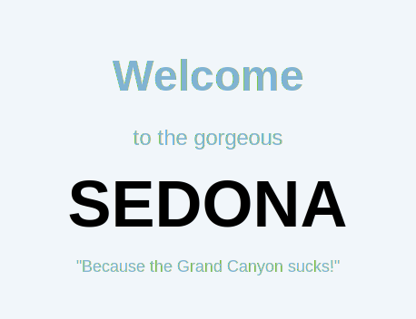

# Урок 4: Приветственный блок (Hero)

## Цели урока
- Создать эффектный приветственный блок
- Работа с фоновыми изображениями
- Позиционирование элементов
- Создание декоративных элементов

## 4.1 HTML разметка Hero секции

```html
<section class="hero">
    <h1 class="visually-hidden">Город Sedona</h1>
    
</section>
```

### Важные моменты:
- Скрытый `<h1>` для SEO и доступности
- Декоративное изображение welcome
- Указание размеров изображения

## 4.2 CSS для Hero - Фоновое изображение

```css
.hero {
    position: relative;
    padding: 51px 0 82px;
    text-align: center;
    background-color: #82b3d3;
    background-image: url("images/hero-background.jpg");
    background-size: cover;
    background-repeat: no-repeat;
    background-position: center;
}
```

### Свойства background:

| Свойство | Значение | Описание |
|----------|----------|----------|
| `background-image` | url(...) | Путь к изображению |
| `background-size` | cover | Покрывает всю область |
| `background-repeat` | no-repeat | Не повторять |
| `background-position` | center | Центрировать |

### Альтернативная краткая запись:
```css
.hero {
    background: #82b3d3 url("images/hero-background.jpg") center/cover no-repeat;
}
```

## 4.3 Создание декоративного разделителя

```css
.hero::after {
    content: "";
    position: absolute;
    bottom: 0;
    left: 0;
    width: 100%;
    height: 57px;
    background-image: url("images/hero-divider.svg");
    background-repeat: no-repeat;
    background-size: cover;
}
```

### Псевдоэлементы ::before и ::after

Используются для добавления декоративных элементов:

```css
.element::before {
    content: ""; /* Обязательное свойство! */
    /* Остальные стили */
}
```

## 4.4 Центрирование изображения

```css
.hero-image {
    display: block;
    margin: 0 auto;
}
```

## 4.5 Адаптивность Hero секции

```css
@media (max-width: 767px) {
    .hero {
        padding: 30px 20px 50px;
    }
    
    .hero-image {
        max-width: 100%;
        height: auto;
    }
}
```

## Практическое задание

1. ✅ Создайте Hero секцию
2. ✅ Добавьте фоновое изображение
3. ✅ Добавьте декоративный разделитель
4. ✅ Проверьте на разных размерах экрана

## Контрольные вопросы

1. Что делает `background-size: cover`?
2. Зачем нужен `content: ""` в псевдоэлементах?
3. Как сделать изображение адаптивным?

---

[⬅️ Предыдущий урок](lesson-03-header-navigation.md) | [Следующий урок: Преимущества ➡️](lesson-05-advantages-section.md)
